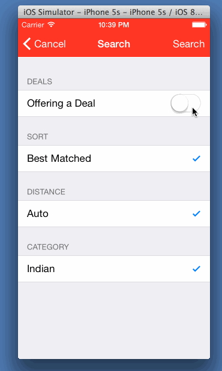

Yelp
=

A simple Yelp client. It allows you to search Yelp for businesses with the option to sort and filter the results

Time spent: ~15 hours

Completed user stories

####Search results page
 * [x] Required: Table rows should be dynamic height according to the content height
 * [x] Required: Custom cells should have the proper Auto Layout constraints
 * [x] Required: Search bar should be in the navigation bar
 * [x] Optional: Loading indicator for results page

####Filter page
 * [x] Required: The filters you should actually have are: category, sort (best match, distance, highest rated), distance(auto/100 meters) deals (on/off).
 * [x] Required: The filters table should be organized into sections as in the mock.
 * [x] Required: You can use the default UISwitch for on/off states.
 * [x] Required: Clicking on the "Search" button should dismiss the filters page and trigger the search w/ the new filter settings.

Walkthrough
-

